We're a UK data and AI consultancy. We run client work as **Missions**: fixed scope,
strategy through to deployment, and we stick around to make sure it works.

This is our public profile with some of the tooling we generalise and release for free and
open use.

<table>
<tr>
<td width="50%" valign="top">

</td>
<td width="50%" valign="top">

`> watching the org is the fastest way to hear about the next one`

</td>
</tr>
</table>

 

<a href="https://stellarglyph.io">stellarglyph.io</a> &nbsp;·&nbsp; <a href="https://stellarglyph.io/missions">Missions</a> &nbsp;·&nbsp; <a href="https://stellarglyph.io/blog">Blog</a> &nbsp;·&nbsp; <a href="https://stellarglyph.io/contact">Contact</a>

<code>// data driven. ai native. // end of transmission</code>

